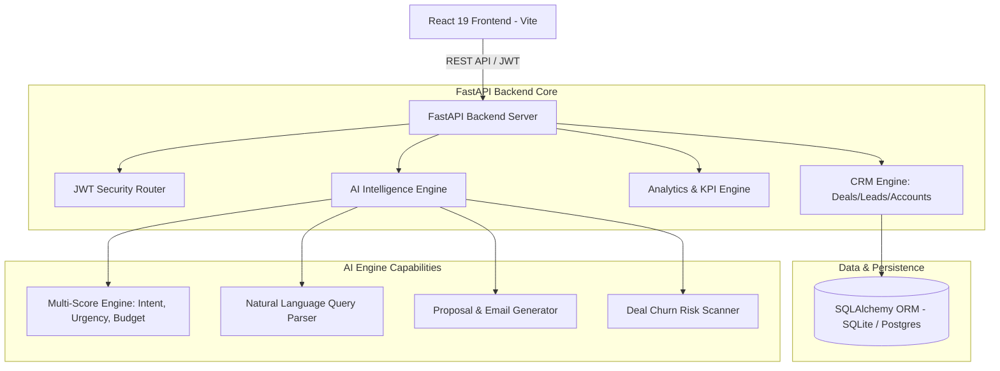
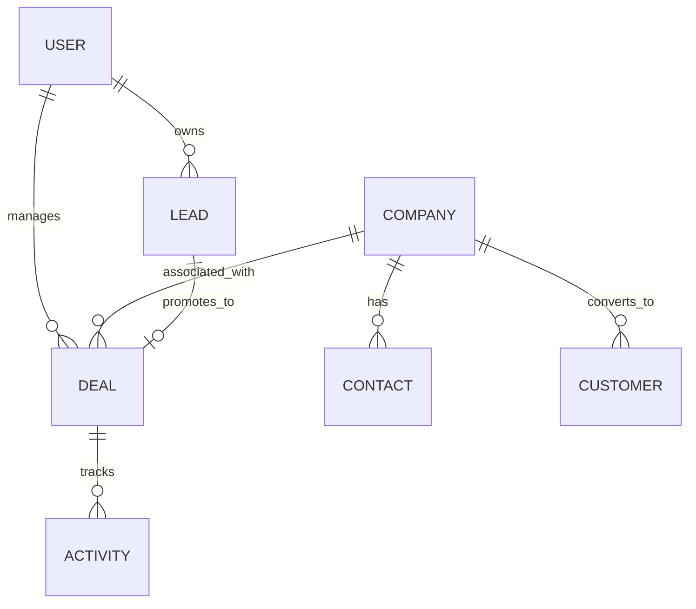

# Vertical RevOps AI — AI-Powered Revenue Operations Platform

> **Startup-Grade Revenue Operations OS** designed to compete with modern RevOps platforms like **HubSpot**, **Attio**, **Salesforce Starter**, and **Linear**. Built with React 19, FastAPI (Python), SQLAlchemy, JWT Authentication, and a multi-dimensional AI Engine.

---

## 🏗️ System Architecture

Vertical RevOps AI uses a high-performance decoupled client-server architecture with an integrated Python AI Intelligence Service and real-time JWT authentication.



---

## 🗄️ Relational Database Schema (ERD)



---

## ✨ Key Features & Capabilities

### 1. Executive Revenue Dashboard
- **10 Core KPI Cards**: Total Revenue, MRR, ARR, New Leads, Qualified Leads, Meetings Conducted, Deals Won, Deals Lost, Conversion Rate, Average Deal Size.
- **Recharts Visualizations**: Monthly Revenue Progression vs Target, Pipeline Stage Funnel, Lead Acquisition Source, and Team Quota Leaderboard.

### 2. Drag & Drop Revenue Pipeline (Kanban)
- Interactive deal pipeline supporting 7 stages: `New`, `Qualified`, `Meeting`, `Proposal`, `Negotiation`, `Won`, and `Lost`.
- Real-time win probability updates and automated activity logs upon stage movement.

### 3. AI Intelligence Hub
- **AI Opportunity Lead Scoring**: Multi-dimensional scoring (Intent, Urgency, Budget, Engagement, Win Probability).
- **Natural Language AI Search**: Prompt pipeline with natural language (e.g. *"Show enterprise deals > $50k stuck in negotiation"*).
- **AI Content Generator**: One-click generation of Cold Emails and Executive Proposals.
- **Deal Churn Risk Scanner**: Real-time detection of stalled deals and recommended next steps.

---

## 📁 Production Folder Structure

```
RevOps/
├── backend/                  # FastAPI Python Backend
│   ├── app/
│   │   ├── api/v1/           # API Routers (/auth, /leads, /deals, /ai, /dashboard, etc.)
│   │   ├── core/             # Security, JWT, Configuration
│   │   ├── db/               # Database Engine & SQLAlchemy Models
│   │   ├── schemas/          # Pydantic Validation Models
│   │   ├── services/         # AI Logic Engine & Lead Scorer
│   │   └── seed.py           # SaaS Dummy Data Generator
│   ├── main.py               # FastAPI App Entrypoint
│   ├── requirements.txt
│   └── Dockerfile
│
├── frontend/                 # React 19 + Vite Frontend
│   ├── src/
│   │   ├── components/       # Sidebar, Header, StatCards, KanbanBoard, AI Workspace Modal
│   │   ├── context/          # AuthContext & ThemeContext
│   │   ├── pages/            # Dashboard, Deals, Leads, Customers, Companies, Analytics, Settings
│   │   ├── services/         # Axios API Client with Mock Fallback
│   │   ├── App.jsx           # App Shell & Router
│   │   └── index.css         # Glassmorphism Design Tokens & CSS Utilities
│   ├── package.json
│   ├── vite.config.js
│   └── Dockerfile
│
├── docker-compose.yml        # Multi-container Setup
└── .github/workflows/        # GitHub Actions CI/CD
    └── ci-cd.yml
```

---

## 🚀 Quick Start & Installation

### 1. Run Backend (FastAPI)
```bash
cd backend
pip install -r requirements.txt
python main.py
```
*OpenAPI Documentation available at `http://localhost:8000/docs`*

### 2. Run Frontend (React 19)
```bash
cd frontend
npm install --legacy-peer-deps
npm run dev
```
*Application opens at `http://localhost:5173`*

### Demo Credentials
- **Email**: `demo@verticalrevops.ai`
- **Password**: `password123`

---

## 🐳 Docker Deployment

To launch both frontend and backend using Docker Compose:
```bash
docker-compose up --build
```
