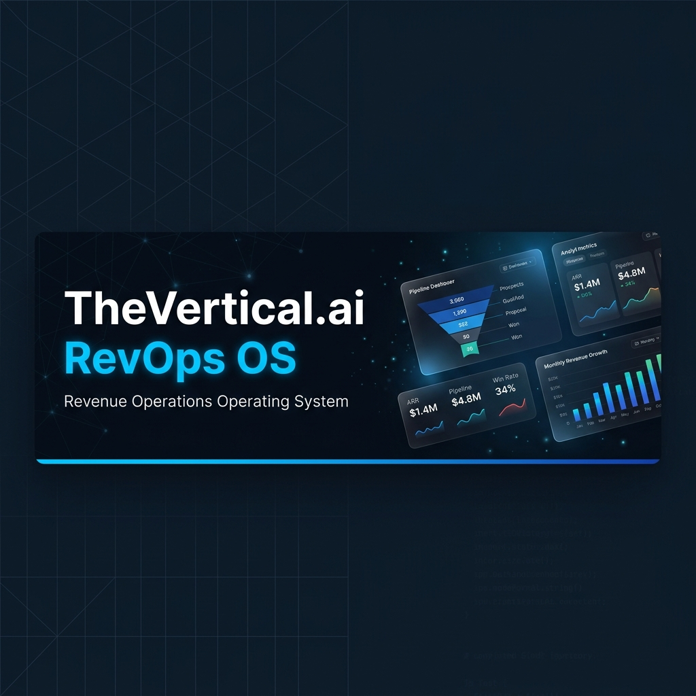
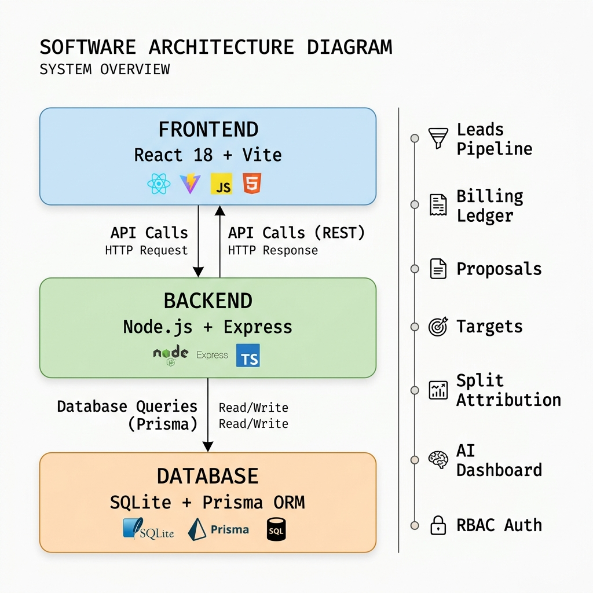
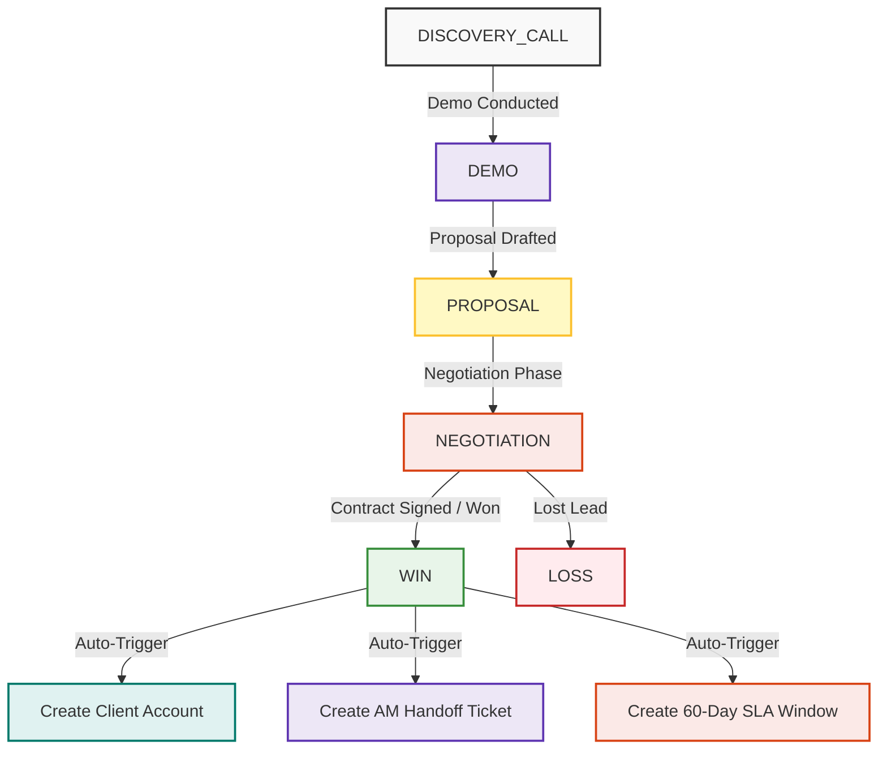
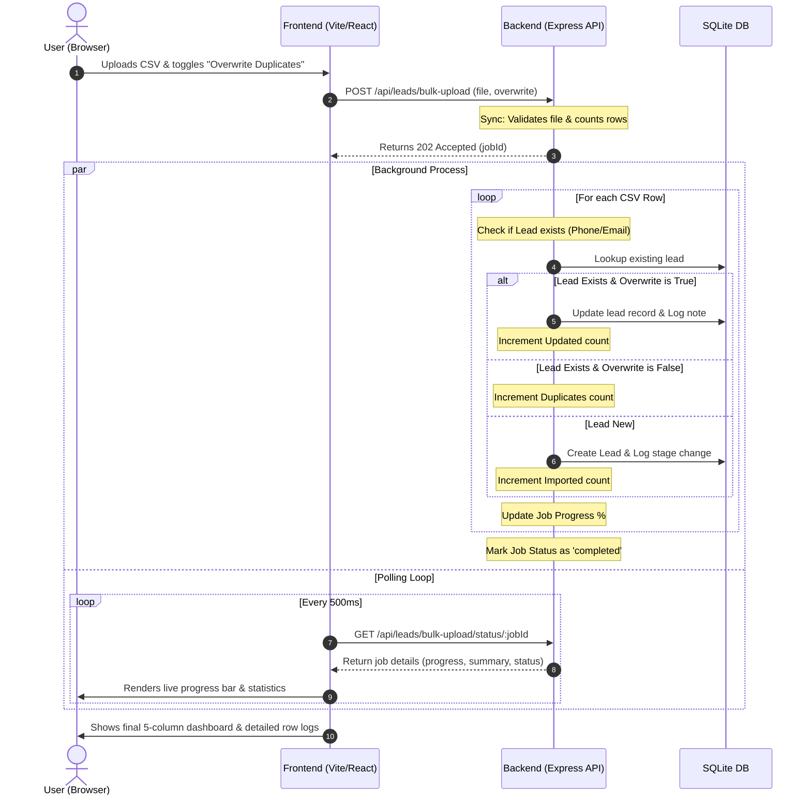
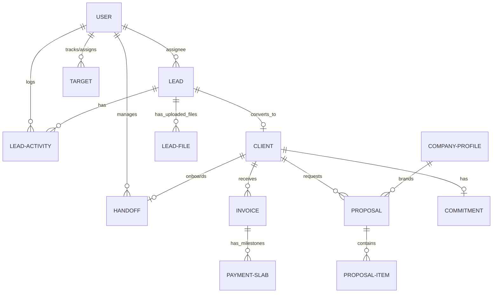
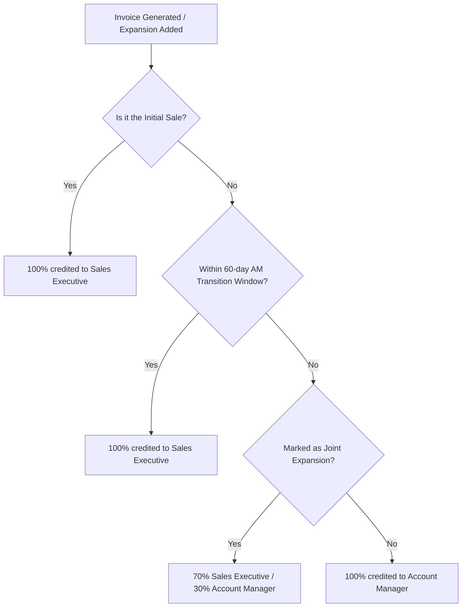

# TheVertical.ai — Revenue Operations OS (RevOps OS)



[](#technology-stack)
[-brightgreen?logo=snyk&logoColor=white)](#-bola-security-architecture)
[](#technology-stack)
[](#license)

A enterprise-grade Revenue Operations Operating System (RevOps OS) designed to automate the complete lead-to-revenue lifecycle. The system manages the entire progression from initial Lead capture, sequential stage-progression pipelines, automated Client handoff triggers, dynamic Proposal building, GST-compliant Billing with automated payment slabs, target tracking, and a smart AI Revenue Intelligence engine.

---

## 🏗️ System Architecture

The RevOps OS is designed using a decoupled Client-Server architecture pattern, ensuring separation of concerns, strict database constraints using Prisma ORM, and conditional role-based interfaces on the client side.



### 1. Lead Stage Progression Lifecycle
To prevent pipeline inflation and data inconsistencies, stage transitions are governed by strict database and API logic. Leads must proceed sequentially through the conversion funnel:



### 2. Asynchronous Bulk Import & Overwrite Engine
To handle bulk leads efficiently without server blocking or request timeouts, the import pipeline uses an in-memory asynchronous worker process with polling. Users can choose to skip or overwrite existing duplicate records matching by phone or email.



### 3. Relational Database Schema Model
RevOps OS utilizes a clean relational database structure. Here is the Entity-Relationship (ER) model managed via Prisma:



### 4. Split Mapping Revenue Attribution Flow
The platform's core financial differentiator is its automated **Split Mapping Engine**. Revenue splits are dynamically calculated on invoice generation and slab completion based on the timeline and engagement structure:



---

## 🔒 BOLA Security Architecture

To prevent **Broken Object Level Authorization (BOLA / IDOR)** and vertical/horizontal privilege escalation, the backend implements granular validation on all sub-resources (Tasks, Files, Clients, Invoices, and Proposals).

```mermaid
sequenceDiagram
    actor SalesExec as Sales Rep / TL (Arun or Ravi)
    participant Router as API Gateway (JWT / RBAC)
    participant AccessHelper as checkLeadAccess (Middleware)
    participant DB as SQLite DB
    
    SalesExec->>Router: GET /api/tasks?leadId=123 (Bearer Token)
    Router->>Router: verifyToken (Decodes User & Role)
    Router->>AccessHelper: checkLeadAccess(leadId="123", User)
    AccessHelper->>DB: Query Lead assignedToId
    DB-->>AccessHelper: Returns assignedToId
    Note over AccessHelper: Resolves accessible user boundaries<br/>(SalesExec has access to self leads; TL to team member leads)
    
    alt User Assigned To Lead OR User is TL of Assigned Member
        AccessHelper-->>Router: Access Approved (true)
        Router->>DB: Fetch tasks for leadId 123
        DB-->>Router: Returns tasks
        Router-->>SalesExec: 200 OK (Tasks payload)
    else Lead owned by someone else
        AccessHelper-->>Router: Access Denied (false)
        Router-->>SalesExec: 403 Forbidden ("Access denied to this lead record")
    end
```

### Dynamic Role Boundaries
1. **Sales Executives (`SALES_EXEC`)**: Can only fetch, update, delete, or create records linked to leads explicitly assigned to them.
2. **Team Leaders (`TEAM_LEADER`)**: Can access leads and related sub-resources assigned to themselves or any member of their team (children recursively mapped via `teamLeaderId`).
3. **Admin / Managers / AM / Finance**: Can access everything globally (or within their respective functional scope).

---

## ⚡ Core Functional Modules

### 💼 Leads & Funnel Pipeline Tracker
*   **Duplicate Prevention**: Real-time telephone number and email validation blocks duplicate entries and alerts the user to link back to the existing record.
*   **Sequential Stage Locks**: Database-level validation prevents skipped steps, keeping historical metrics pristine.
*   **Date-Based Funnel Analysis**: Dynamic time-interval segmentation (`Today`, `Yesterday`, `Tomorrow`, `Custom`) for precise pipeline velocity analysis.
*   **Activity Timeline Audit**: Every call log (with duration in seconds), stage alteration, and text note is tracked with an immutable timestamp.
*   **Bulk Lead Importer**: Drag-and-drop CSV parser with progress indicators, duplicate overwrite checkbox toggle, and row-level logging dashboard.

### 💰 Billing Ledger & GST Engine
*   **Tax Compliance**: Supports live tax compilation with automatic CGST + SGST (intra-state) or IGST (inter-state) computation based on the corporate client's regional state code.
*   **Milestone Slab Automation**: Generates automated payment schedules (such as a default 50% advance / 50% delivery slab structure) linked to invoice generation.
*   **Status Flow**: Slabs dynamically transit from `DRAFT` $\to$ `PARTIALLY_PAID` $\to$ `PAID` as finance logs receipts.

### 🎯 Sales Targets & SVG Metric Rings
*   **Team Leader View**: A spreadsheet target builder to assign call frequency, total talk time (minutes), lead conversion counts, and revenue goals per rep per month.
*   **Sales Rep Dashboard**: Visualizes performance indicators through glowing dynamic SVG circular progress rings showing actuals vs. monthly targets.

---

## 🛠️ Technology Stack & Dependencies

*   **Frontend Client**: React 19, Vite, Tailwind CSS, Lucide Icons, Axios.
*   **Backend Server**: Node.js, Express, Multer, JWT Authentication, CORS.
*   **Database & ORM**: SQLite (for quick, zero-config local runs) & Prisma ORM.

---

## 🚀 Installation & Local Setup

### Prerequisites
*   Node.js (v18.x or above)
*   npm or yarn

### 1. Backend Service Configuration
```bash
# Navigate to the backend directory
cd backend

# Install project dependencies
npm install

# Build the local database schema and run seed scripts
npx prisma migrate dev --name init
npx prisma db seed

# Spin up the development server
npm run dev
```
The API server will launch locally on: **`http://localhost:5000`**

### 2. Frontend Web Interface
```bash
# Navigate to the frontend directory
cd ../frontend

# Install dependencies
npm install

# Spin up the Vite development server
npm run dev
```
Open your browser and navigate to: **`http://localhost:5173`**

---

## 🔑 Demo Profile Credentials

To easily verify different system viewpoints, you can use the **Quick Login Demo Profiles** grid directly on the login screen, or type the credentials manually:

| Profile / Employee Name | Target Role | Authentication Email | Shared Password |
|---|---|---|---|
| **Super Admin** | `SUPER_ADMIN` | `admin@thevertical.ai` | `Password123@` |
| **Arun (Team Leader)** | `TEAM_LEADER` | `arun@thevertical.ai` | `Password123@` |
| **Ravi (Sales Exec)** | `SALES_EXEC` | `ravi@thevertical.ai` | `Password123@` |
| **Deepa (Account Manager)** | `ACCOUNT_MANAGER` | `am@thevertical.ai` | `Password123@` |
| **Finance Desk** | `FINANCE` | `finance@thevertical.ai` | `Password123@` |
| **Raj (General Manager)** | `MANAGER` | `manager@thevertical.ai` | `Password123@` |

---

## 📊 Verification & API Testing

The codebase includes a fully scripted automated integration test script. You can run the tests using:

```bash
# From the backend directory
node scripts/test_api.js
```
The test suite validates **64 distinct assertions**:
1. Role authentication and RBAC blocks.
2. Sequential lead progression checks.
3. Automated client/SLA conversion triggers.
4. Correct tax calculations on proposals and invoices.
5. Asynchronous bulk lead uploads, polling jobs, duplicate tracking, and overwrite update workflows.
6. **BOLA Security validation checks**: verifying that Sales Reps cannot read, update, or create/delete tasks, files, clients, proposals, or invoices belonging to other reps' leads, raising proper `403 Forbidden` responses.

---

## 📄 License
This repository is licensed under the **MIT License**.

*Built for TheVertical.ai by Sandipan Chakraborty — AI/Data Science Intern*
*Internship Target Delivery: June 13, 2026*
