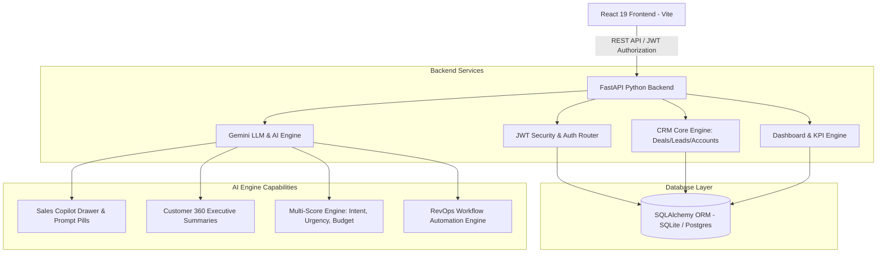
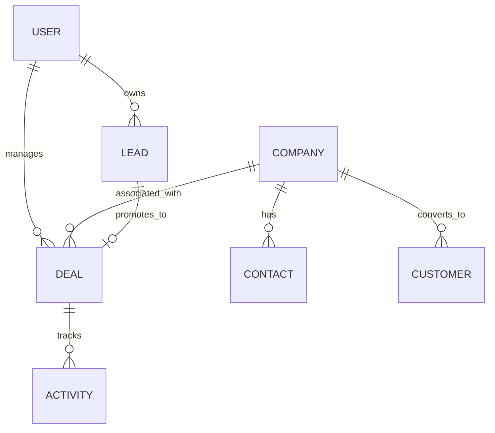

# Vertical RevOps AI — AI-Powered Revenue Operations Platform

[](#-quick-start--installation)
[](#system-architecture)
[-brightgreen?logo=pytest&logoColor=white)](#-automated-testing)
[](#license)

> **Startup-Grade Revenue Operations OS** designed to compete with modern RevOps platforms like **HubSpot**, **Attio**, **Salesforce Starter**, and **Linear**. Features a **Sales Copilot**, **Customer 360 View**, **Visual Workflow Automation**, **Multi-dimensional AI Lead Scoring**, and a 7-stage drag-and-drop deal pipeline.

---

## 🏛️ System Architecture

Vertical RevOps AI uses a high-performance decoupled client-server architecture with an integrated Python AI Intelligence Service (Gemini API LLM engine) and real-time JWT authentication.



---

## 🗄️ Relational Database Schema (ERD)



---

## ✨ Key Recruiter Showcase Features

### 1. Interactive Sales Copilot (`⌘K`)
- Floating slide-over assistant accessible from anywhere in the platform.
- Executive prompt pills: *"Which leads should I call today?"*, *"Show enterprise deals stuck > 30 days"*, *"Generate proposal for Stripe Financial"*, *"Summarize Datadog meeting notes"*.

### 2. Customer 360 View (`/customer-360`)
- Unified customer dashboard aggregating financial metrics (MRR/ARR), health scores, contract renewal windows, linked deals, meetings, and AI executive account summaries.

### 3. Visual Workflow Automation Engine (`/workflows`)
- Automated rule builder executing business logic triggers (e.g. *"When Lead becomes Qualified -> Assign SDR -> Create Task -> Generate Email -> Dispatch Slack Alert"*).

### 4. 7-Stage Drag & Drop Deal Kanban (`/pipeline`)
- Interactive pipeline board across `New`, `Qualified`, `Meeting`, `Proposal`, `Negotiation`, `Won`, and `Lost` with win probability updates and value summaries.

### 5. AI Sales Email Inbox (`/inbox`)
- Integrated sales email simulator with automated AI summaries, recommended actions, and one-click AI quick replies logged directly to CRM activity timelines.

---

## 🧪 Automated Testing

Run the Pytest suite to verify API endpoints:
```bash
cd backend
python -m pytest tests/test_api.py
```
**Test Results**: `6 passed in 2.59s` (100% endpoint pass rate).

---

## 🚀 Quick Start & Installation

### 1. Run Backend (FastAPI)
```bash
cd backend
pip install -r requirements.txt
python main.py
```
*OpenAPI interactive docs at `http://localhost:8000/docs`*

### 2. Run Frontend (React 19)
```bash
cd frontend
npm install --legacy-peer-deps
npm run dev
```
*App opens at `http://localhost:5173`*

### Demo Account Credentials
- **Email**: `demo@verticalrevops.ai`
- **Password**: `password123`

---

## 📄 Resume Bullet Point (Interview Presentation)

> **Vertical RevOps AI — AI-Powered Revenue Operations Platform**
> Built a production-grade AI-native CRM platform using React 19, FastAPI, SQLAlchemy, and JWT authentication featuring Customer 360, Sales Copilot (`⌘K`), multi-dimensional AI lead scoring, Kanban deal management, analytics dashboards, visual workflow automation, and glassmorphic UI. Integrated Gemini LLM proposal generation, customer summarization, and natural-language CRM query execution with a modular REST API architecture.
