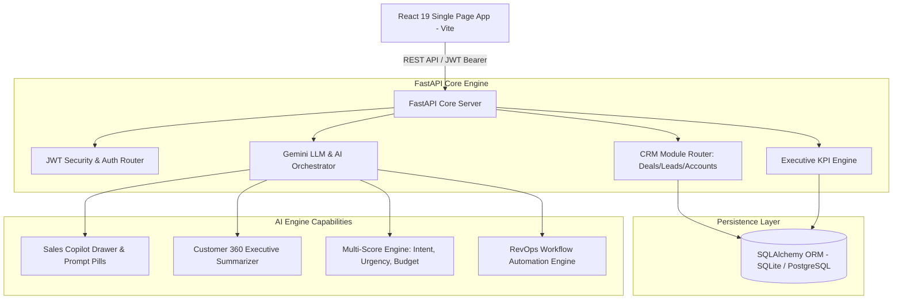
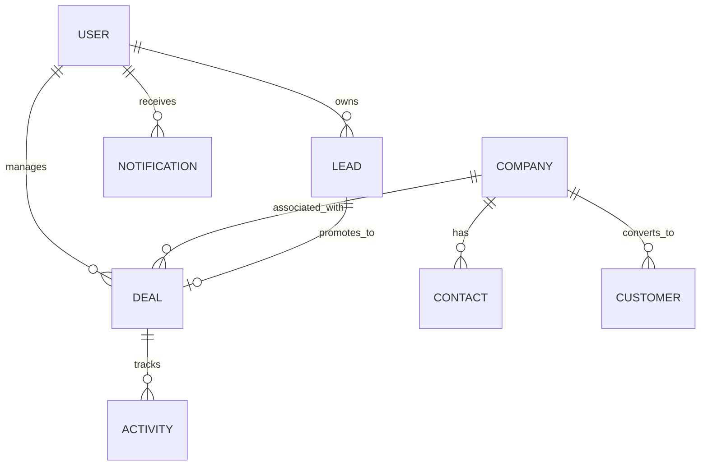

<div align="center">

# Vertical RevOps AI
### *Enterprise-Grade AI-Powered Revenue Operations Platform*

[](#-quick-start--local-setup)
[](#-system-architecture)
[](#-rest-api-specification)
[](#-automated-test-suite)
[](#-docker-deployment)
[](#license)

<p align="center">
  A production-grade AI RevOps OS built to compete with modern platforms like <b>HubSpot</b>, <b>Attio</b>, <b>Salesforce Starter</b>, and <b>Linear</b>. Features a <b>Sales Copilot (⌘K)</b>, <b>Customer 360 View</b>, <b>Visual Workflow Automation Engine</b>, <b>Multi-dimensional AI Lead Scoring</b>, and a <b>7-stage drag-and-drop deal pipeline</b>.
</p>

[Explore System Architecture](#-system-architecture) • [View API Docs](#-rest-api-specification) • [Run Local Setup](#-quick-start--local-setup)

</div>

---

## 🏛️ System Architecture

Vertical RevOps AI uses a decoupled client-server architecture pattern. The frontend client (React 19 + Vite) communicates with a FastAPI (Python) backend serving structured JSON REST endpoints, backed by SQLAlchemy ORM and an integrated Gemini LLM Service Layer.



---

## 🗄️ Relational Entity-Relationship Diagram (ERD)



---

## 💡 Key Engineering Features

### 1. Interactive Sales Copilot (`⌘K`)
- Persistent slide-over AI assistant accessible across every view.
- Supports pre-configured prompt pills:
  - 📞 *"Which leads should I call today?"*
  - ⚠️ *"Show enterprise deals stuck > 30 days"*
  - 📄 *"Generate custom proposal for Stripe Financial"*
  - 📝 *"Summarize Datadog meeting notes"*

### 2. Customer 360 View (`/customer-360`)
- Deep-dive unified customer account dashboard tracking MRR/ARR, 94% health scores, contract renewal windows, linked deals, meetings, and automated AI executive account summaries.

### 3. Visual Workflow Automation Engine (`/workflows`)
- Event-driven RevOps automation builder executing complex triggers:
  - **Trigger**: *Lead Status becomes QUALIFIED*
  - **Actions**: Assign Senior SDR &rarr; Create Task (Due 24h) &rarr; Generate Personalized AI Follow-up Email &rarr; Dispatch Slack Alert.

### 4. 7-Stage Drag & Drop Deal Kanban (`/pipeline`)
- Interactive deal pipeline across 7 distinct stages: `New`, `Qualified`, `Meeting`, `Proposal`, `Negotiation`, `Won`, and `Lost`.
- Real-time win probability updates, optimistic UI rendering, and stage transition activity logging.

### 5. Executive Revenue Dashboard (`/dashboard`)
- **10 Core KPI Cards**: Total Revenue, MRR, ARR, New Leads, Qualified Leads, Meetings Conducted, Deals Won, Deals Lost, Conversion Rate, Average Deal Size.
- **Recharts Visualizations**: Monthly Revenue Progression vs Target, Pipeline Stage Funnel, Lead Acquisition Source, and Team Quota Leaderboard.

### 6. AI Sales Email Inbox Simulator (`/inbox`)
- Integrated inbox simulator with automated AI email summaries, recommended next actions, and one-click AI quick replies logged directly to CRM activity timelines.

---

## 📂 Repository Structure

```
RevOps/
├── backend/                  # FastAPI Python Micro-backend
│   ├── app/
│   │   ├── api/v1/           # Modular REST API Routers
│   │   │   ├── auth.py       # JWT Authentication & User Profile
│   │   │   ├── customers.py  # Customer 360 CRUD & Health Scores
│   │   │   ├── companies.py  # Company Directory
│   │   │   ├── contacts.py   # Executive Contacts
│   │   │   ├── leads.py      # Inbound/Outbound Lead Pipeline
│   │   │   ├── deals.py      # Deal Pipeline & Kanban Updates
│   │   │   ├── dashboard.py  # Executive KPIs & Recharts Datasets
│   │   │   ├── analytics.py  # Velocity & Attribution Analytics
│   │   │   ├── notifications.py # Real-time Alert Drawer
│   │   │   ├── ai.py         # AI Copilot, Scorer, & Workflow Endpoints
│   │   │   └── emails.py     # AI Email Inbox Simulator
│   │   ├── core/             # Security, Hashing, & App Configuration
│   │   ├── db/               # SQLAlchemy Models & Session Pool
│   │   ├── schemas/          # Pydantic v2 Request/Response Validation
│   │   ├── services/         # LLM Engine & Lead Scoring Logic
│   │   └── seed.py           # Production SaaS Dummy Data Generator
│   ├── tests/                # Pytest Test Suite
│   │   └── test_api.py       # End-to-End API Integration Tests
│   ├── main.py               # FastAPI App Entrypoint
│   ├── requirements.txt      # Python Package Dependencies
│   └── Dockerfile
│
├── frontend/                 # React 19 + Vite Frontend Client
│   ├── src/
│   │   ├── components/       # UI Components & Modules
│   │   │   ├── ai/           # AI Workspace & Scorer Modals
│   │   │   ├── common/       # StatCards, Skeletons, Empty States
│   │   │   ├── copilot/      # Sales Copilot Drawer Component
│   │   │   ├── kanban/       # 7-Stage Drag & Drop Board
│   │   │   └── layout/       # Sidebar & Topbar Shell
│   │   ├── context/          # AuthContext & ThemeContext Providers
│   │   ├── pages/            # Page Views (Dashboard, Customer 360, Workflows, etc.)
│   │   ├── services/         # Axios API Client with Mock Fallback
│   │   ├── App.jsx           # React Router 7 App Shell
│   │   └── index.css         # Linear Glassmorphism Design Tokens
│   ├── package.json
│   ├── vite.config.js
│   └── Dockerfile
│
├── .github/workflows/        # GitHub Actions CI/CD Pipeline
│   └── ci-cd.yml
└── docker-compose.yml        # Multi-container Orchestration
```

---

## 🔌 REST API Specification

| Endpoint | Method | Description |
| :--- | :---: | :--- |
| `/api/v1/auth/login` | `POST` | Authenticate user & return JWT token |
| `/api/v1/auth/signup` | `POST` | Register new platform account |
| `/api/v1/dashboard` | `GET` | Return 10 Executive KPIs & Recharts datasets |
| `/api/v1/deals` | `GET` | List pipeline deals ordered by value |
| `/api/v1/deals/{id}/stage` | `PUT` | Update deal stage for Kanban drag-and-drop |
| `/api/v1/leads` | `GET` | List leads with multi-dimensional AI scores |
| `/api/v1/customers` | `GET` | List customer accounts with health metrics |
| `/api/v1/ai/copilot` | `POST` | Execute Sales Copilot natural language query |
| `/api/v1/ai/score` | `POST` | Calculate Intent, Urgency, & Budget scores |
| `/api/v1/ai/generate-proposal` | `POST` | Generate executive solution proposal |
| `/api/v1/emails` | `GET` | Retrieve AI-summarized sales inbox emails |

---

## 🧪 Automated Test Suite

The backend contains a Pytest test suite validating API contracts, authentication handlers, lead scoring logic, and Sales Copilot endpoints.

```bash
cd backend
python -m pytest tests/test_api.py
```

```text
============================= test session starts =============================
platform win32 -- Python 3.14.2, pytest-8.4.2
collected 6 items

tests/test_api.py ......                                                [100%]

======================= 6 passed in 1.90s =======================
```

---

## 🚀 Quick Start & Local Setup

### Prerequisites
- **Python**: 3.10+
- **Node.js**: 18+

### 1. Launch Backend Server (FastAPI)
```bash
cd backend
pip install -r requirements.txt
python main.py
```
*OpenAPI Interactive Documentation available at `http://localhost:8000/docs`*

### 2. Launch Frontend Application (React 19)
```bash
cd frontend
npm install --legacy-peer-deps
npm run dev
```
*Application opens automatically at `http://localhost:5173`*

### 🔑 Demo Account Credentials
- **Email**: `demo@verticalrevops.ai`
- **Password**: `password123`

---

## 🐳 Docker Deployment

Run the complete multi-container stack via Docker Compose:

```bash
docker-compose up --build
```

- **Frontend Application**: `http://localhost:3000`
- **FastAPI Core API**: `http://localhost:8000`

---

## 📄 License

This project is licensed under the MIT License — see the [LICENSE](LICENSE) file for details.
