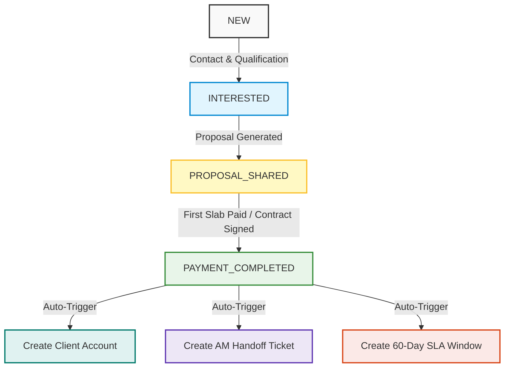
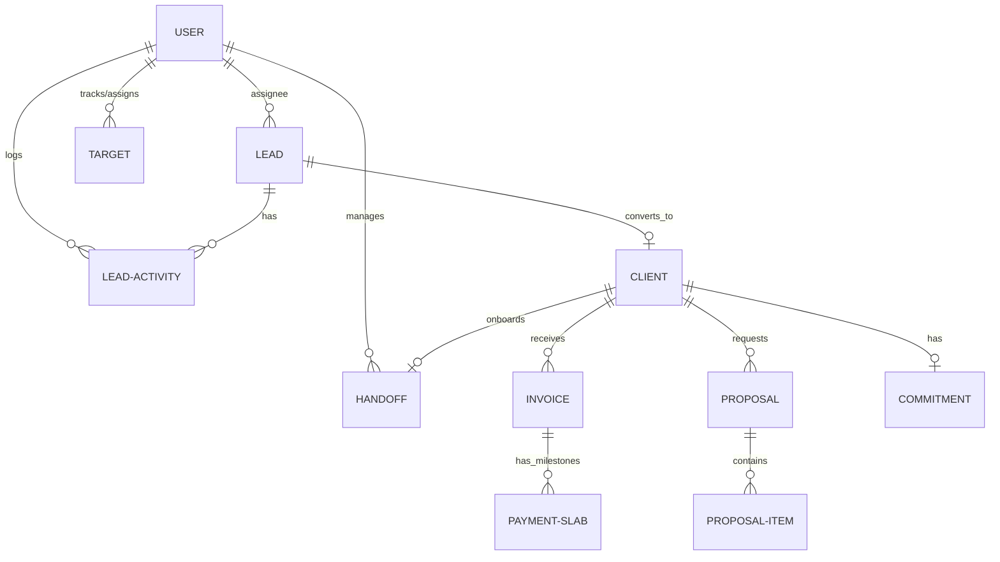
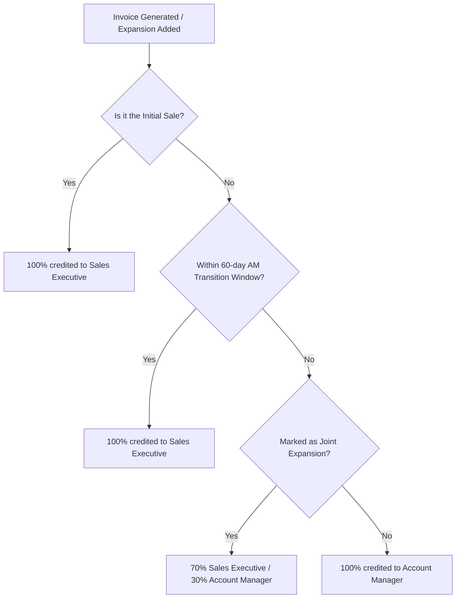

# TheVertical.ai — Revenue Operations OS (RevOps OS)


[](#technology-stack)
[](#license)
[](#project-scope--milestones)
[](#system-architecture)

A enterprise-grade, cloud-native Revenue Operations Operating System (RevOps OS) designed to automate the complete lead-to-revenue lifecycle. The system manages the entire progression from initial Lead capture, strict stage-progression pipelines, automated Client handoff triggers, dynamic Proposal building, GST-compliant Billing with automated payment slabs, target tracking, and a smart AI Revenue Intelligence engine.

---

## 🏗️ System Architecture

The RevOps OS is designed using a decoupled Client-Server architecture pattern, ensuring separation of concerns, strict database constraints using Prisma ORM, and conditional role-based interfaces on the client side.


### 1. Lead Stage Progression Lifecycle
To prevent pipeline inflation and data inconsistencies, stage transitions are governed by strict database and API logic. Leads must proceed sequentially through the conversion funnel:



### 2. Relational Database Schema Model
RevOps OS utilizes a clean relational database structure. Here is the Entity-Relationship (ER) model managed via Prisma:



### 3. Split Mapping Revenue Attribution Flow
The platform's core financial differentiator is its automated **Split Mapping Engine**. Revenue splits are dynamically calculated on invoice generation and slab completion based on the timeline and engagement structure:



---

## ⚡ Core Functional Modules

### 🔒 Enterprise-Grade RBAC Authorization
Access controls are enforced on both the client UI and API router levels. The permissions matrix spans six granular roles:
*   **Super Admin**: Manage team configurations, master GST tax slab settings, and platform settings.
*   **Manager**: View consolidated global revenue pipelines, team conversion metrics, and override deals.
*   **Team Leader**: Manage specific sales representatives, view conversion velocity, and assign monthly performance targets.
*   **Sales Executive**: Capture leads, update sales funnel stages, log manual call notes/durations, and build client proposals.
*   **Account Manager**: Complete SLA-monitored client onboarding checklists, check expansion windows, and configure client commitments.
*   **Finance**: Build and issue GST-compliant tax invoices, configure payment milestones, and record slab receipts.

### 💼 Leads & Funnel Pipeline Tracker
*   **Duplicate Prevention**: Real-time telephone number validation blocks duplicate entries and alerts the user to link back to the existing record.
*   **Sequential Stage Locks**: Database-level validation prevents skipped steps, keeping historical metrics pristine.
*   **Activity Timeline Audit**: Every call log (with duration in seconds), stage alteration, and text note is tracked with an immutable timestamp.

### 💰 Billing Ledger & GST Engine
*   **Tax Compliance**: Supports live tax compilation with automatic CGST + SGST (intra-state) or IGST (inter-state) computation based on the corporate client's regional state code.
*   **Milestone Slab Automation**: Generates automated payment schedules (such as a default 50% advance / 50% delivery slab structure) linked to invoice generation.
*   **Status Flow**: Slabs dynamically transit from `DRAFT` $\to$ `PARTIALLY_PAID` $\to$ `PAID` as finance logs receipts.

### 🎯 Sales Targets & SVG Metric Rings
*   **Team Leader View**: A spreadsheet target builder to assign call frequency, total talk time (minutes), lead conversion counts, and revenue goals per rep per month.
*   **Sales Rep Dashboard**: Visualizes performance indicators through glowing dynamic SVG circular progress rings showing actuals vs. monthly targets.

---

## 🛠️ Technology Stack & Dependencies

*   **Frontend Client**: React 18, Vite, Tailwind CSS, Lucide Icons, Axios.
*   **Backend Server**: Node.js, Express, JWT Authentication, CORS.
*   **Database & ORM**: SQLite (for quick, zero-config local runs) & Prisma ORM.

---

## 🚀 Installation & Local Setup

### Prerequisites
*   Node.js (v18.x or above)
*   npm or yarn

### 1. Backend Service Configuration
```bash
# Navigate to the backend directory
cd backend

# Install project dependencies
npm install

# Build the local database schema and run seed scripts
npx prisma migrate dev --name init
npx prisma db seed

# Spin up the development server
npm run dev
```
The API server will launch locally on: **`http://localhost:5000`**

### 2. Frontend Web Interface
```bash
# Navigate to the frontend directory
cd ../frontend

# Install dependencies
npm install

# Spin up the Vite development server
npm run dev
```
Open your browser and navigate to: **`http://localhost:5173`**

---

## 🔑 Demo Profile Credentials

To easily verify different system viewpoints, you can use the **Quick Login Demo Profiles** grid directly on the login screen, or type the credentials manually:

| Profile / Employee Name | Target Role | Authentication Email | Shared Password |
|---|---|---|---|
| **Super Admin** | `SUPER_ADMIN` | `admin@thevertical.ai` | `Password123@` |
| **Arun (Team Leader)** | `TEAM_LEADER` | `arun@thevertical.ai` | `Password123@` |
| **Ravi (Sales Exec)** | `SALES_EXEC` | `ravi@thevertical.ai` | `Password123@` |
| **Deepa (Account Manager)** | `ACCOUNT_MANAGER` | `am@thevertical.ai` | `Password123@` |
| **Finance Desk** | `FINANCE` | `finance@thevertical.ai` | `Password123@` |
| **Raj (General Manager)** | `MANAGER` | `manager@thevertical.ai` | `Password123@` |

---

## 📊 Verification & API Testing

The codebase includes a fully scripted automated integration test script. You can run the tests using:

```bash
# From the project root
node backend/scripts/test_api.js
```
The test suite validates:
1. Role authentication and RBAC blocks (e.g., verifying Sales Reps are blocked from billing actions).
2. Sequential lead progression checks.
3. Automated client/SLA conversion triggers.
4. Correct tax calculations on proposals and invoices.

---

## 📄 License
This repository is licensed under the **MIT License**.

*Built for TheVertical.ai by Sandipan Chakraborty — AI/Data Science Intern*
*Internship Target Delivery: June 13, 2026*
